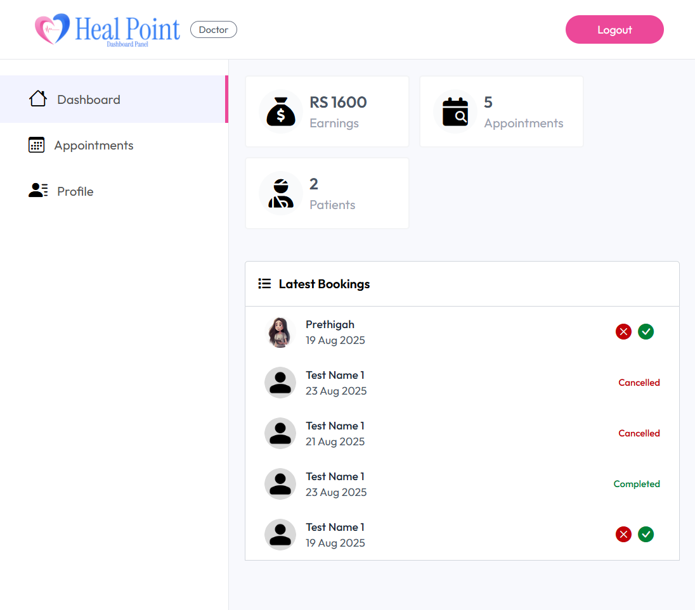
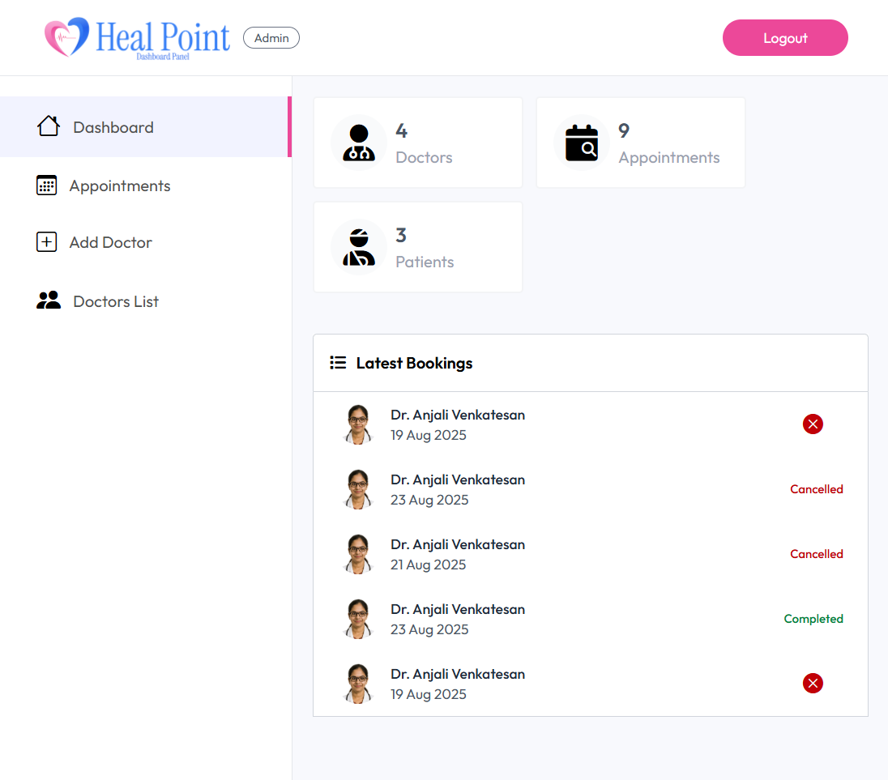

```markdown
# 🩺 Full Stack Doctor Appointment Booking System (MERN Stack)

[](https://reactjs.org/)
[](https://nodejs.org/)
[](https://www.mongodb.com/)
[](https://expressjs.com/)

A Full Stack Doctor Appointment Booking System built with React.js, Node.js, Express.js, and MongoDB (MERN Stack). The app enables patients, doctors, and admins to interact via role-based authentication.

---

## Features

### Patient Portal
- Register/Login as patient
- Book and manage appointments
- Cancel appointments

### Doctor Dashboard
- Login as doctor
- View appointments
- Update profile
- Track earnings

### Admin Panel
- Manage appointments
- Manage doctor profiles
- Dashboard analytics

> ⚠️ Note: Online payment is not yet implemented.

---

## Technologies Used
- Frontend: React.js, HTML, CSS
- Backend: Node.js, Express.js
- Database: MongoDB
- Authentication: JWT role-based authentication

---

## Folder Structure

```

Frontend-HealPoint/
Backend-HealPoint/
Admin-HealPoint/

````

---

## Screenshots

### Patient Portal


### Doctor Dashboard


### Admin Panel


---

## How to Run

### Backend
```bash
cd Backend-HealPoint
npm install
npm run server
````

### Frontend

```bash
cd Frontend-HealPoint
npm install
npm run dev
```

### Admin Panel

```bash
cd Admin-HealPoint
npm install
npm run dev
```

---

## References

This project is based on the YouTube tutorial:
[Build Full Stack Doctor Appointment Booking System Using MERN Stack | Complete React JS Project](https://youtu.be/eRTTlS0zaW8?si=pbPTBNP1QBG1k3N)

---

## Project Link

[GitHub Repository](https://github.com/PrethigahShanmugarajah)

---

## Author

**Prethigah Shanmugarajah**
Department of Software Engineering, Faculty of Computing
Sabaragamuwa University of Sri Lanka

```
```
